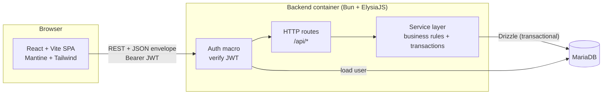
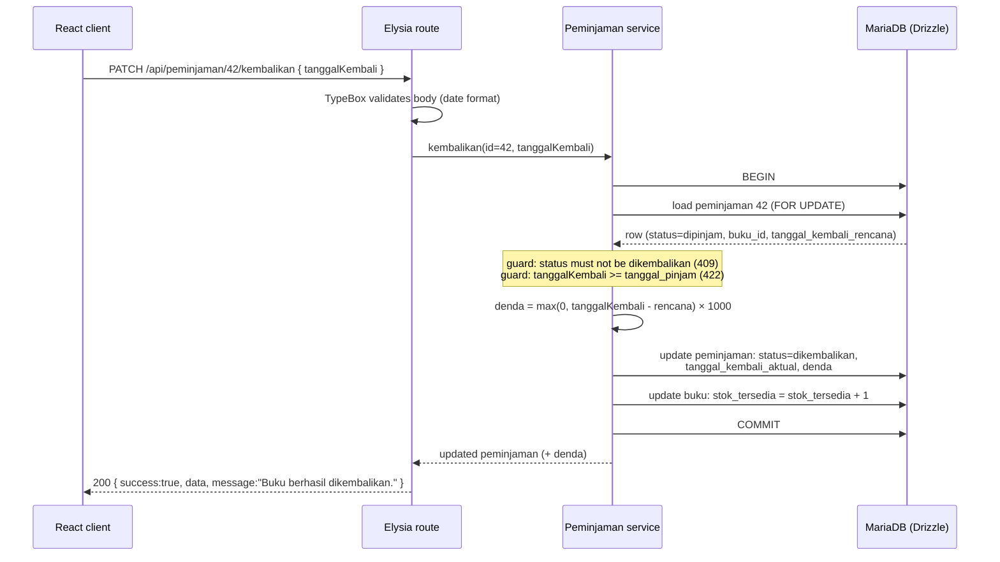
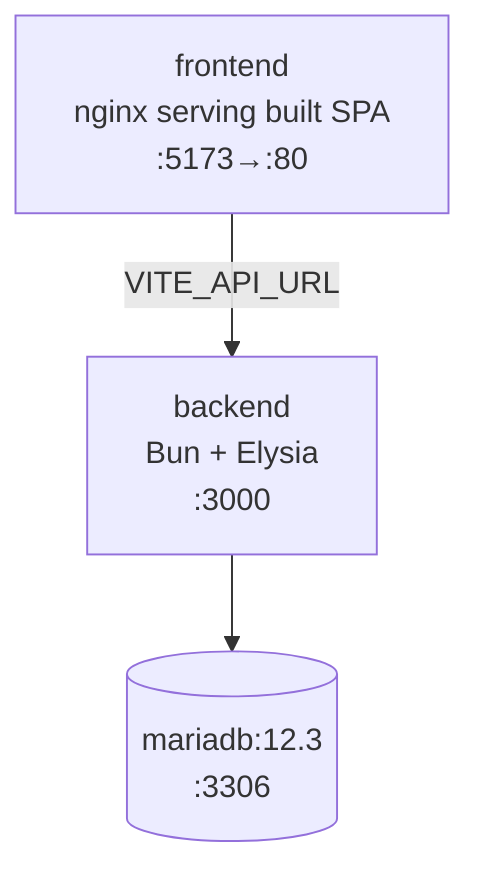

# 01 — Architecture

## System diagram



**One channel, one app:** request/response over HTTP for all CRUD and the return
action (`/api/*`). There is no WebSocket. Every request except `POST
/api/auth/login` carries a **Bearer JWT** that the auth macro verifies before the
handler runs (401 if missing/invalid — see [04-authentication.md](./04-authentication.md)).
The edge concerns are **CORS** (the frontend origin) and **auth**, both in
middleware.

## Layered structure (backend)

```
route (Elysia)  →  auth macro (verify JWT)  →  validates input (TypeBox)
      │
      ▼
service          →  business rules + state guards + DB transactions
      │
      ▼
repository       →  Drizzle queries against MariaDB
```

- **Route layer** — declares method/path, the `{ auth: true }` guard, and TypeBox
  schemas. Thin; delegates to a service. The auth macro asserts *authenticated*
  only — there are no roles to check (see [04](./04-authentication.md)).
- **Service layer** — the only place business rules live: stock adjustment, fine
  computation, the "no active loan for the same book" check, member-number
  generation. Anything that touches more than one row runs inside a **transaction**.
- **Repository layer** — Drizzle calls. Keeps SQL out of services.

Modules are vertical slices: `modules/peminjaman/{routes,service,repository}.ts`.
This keeps each feature understandable in isolation.

## Request lifecycle (example: process a book return)

The return is the most interesting request — it touches two tables and computes a
fine, all atomically.



The same transactional shape applies to **creating a loan** (decrement stock +
insert loan), guaranteeing `stok_tersedia` never drifts. See
[03-business-rules.md](./03-business-rules.md).

## Type-sharing with Eden Treaty

End-to-end type safety, no generated client and no manual API types.

1. The backend composes its whole app and **exports its type**:

   ```ts
   // apps/backend/src/index.ts
   const app = new Elysia()
     .use(bukuModule)
     .use(anggotaModule)
     .use(peminjamanModule)
     .use(dashboardModule)
     .listen(3000)

   export type App = typeof app   // ← the contract
   ```

2. `packages/shared` re-exports `App` plus hand-authored enums/DTO types that both
   sides reference (status enum, DTO shapes).

3. The frontend builds a typed client from that type:

   ```ts
   // apps/frontend/src/api/client.ts
   import { treaty } from '@elysiajs/eden'
   import type { App } from '@perpustakaan/backend'
   import { getToken } from '../auth/auth-store'

   export const api = treaty<App>(import.meta.env.VITE_API_URL, {
     headers() {
       const token = getToken()
       return token ? { authorization: `Bearer ${token}` } : {}
     },
   })
   ```

   Calls like `api.buku.get()` are fully typed against the server's actual routes
   and validators. If a route's response shape changes, the frontend fails to
   compile — drift is caught at build time. The `headers()` hook attaches the
   bearer token at *runtime* (Eden gives compile-time types; auth is a runtime
   concern — see [04](./04-authentication.md) and [06](./06-frontend.md)).

> **Build-time coupling (must handle in Docker):** `import type { App }` makes the
> frontend's **type-check** depend on backend source. Because `import type` is fully
> erased by esbuild, the **production build is decoupled** — the frontend container
> runs `vite build` only (no `tsc`), so it does **not** need backend source at build
> time. Type-checking against `App` happens in dev/CI where the whole workspace is
> present (`bun run typecheck`). This split is mandatory; see
> [07-docker-deployment.md](./07-docker-deployment.md).

## Containers & topology

Three services in `docker-compose.yml` (detail in [07](./07-docker-deployment.md)):



- **frontend** — multi-stage build; Vite builds static assets, served by nginx.
- **backend** — Bun image; runs migrations then starts Elysia (HTTP only).
- **mariadb** — official image with a named volume and healthcheck; backend waits
  for healthy.

No realtime service and no message bus are needed — there is no push channel.
This is a strictly simpler topology than the companion Project 1.
