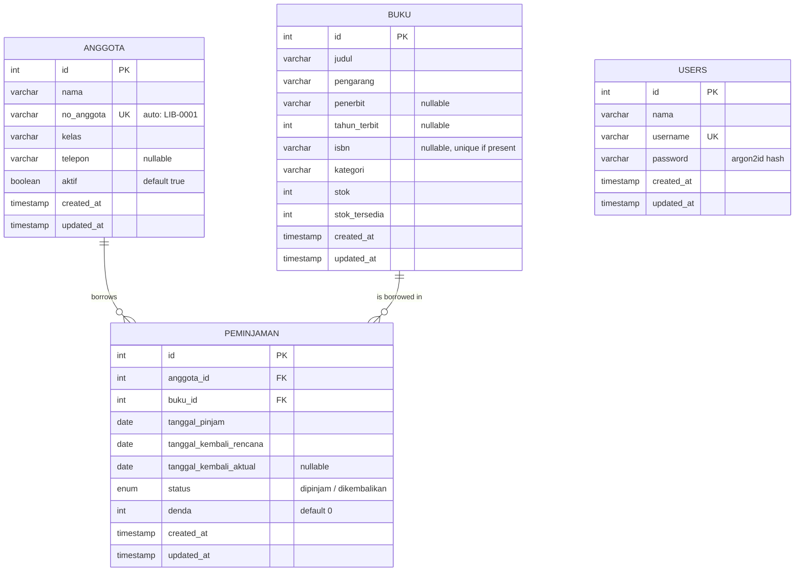

# 02 — Data Model

ORM: **Drizzle** (`drizzle-orm/mysql2`). Driver: `mysql2`. Database: **MariaDB**
(MySQL-compatible) — Drizzle has no separate MariaDB dialect; `mysql-core`
(`mysqlTable`, `mysqlEnum`, …) and the `mysql` Drizzle-Kit dialect target MariaDB
unchanged. All identifiers in **English**; enum *values* keep their Indonesian
domain spelling because they are domain terms, not UI copy.

## ER diagram

`USERS` (library staff) stands alone — it backs login only and is not linked to
loans (the FRD does not track which staff recorded a loan). See
[04-authentication.md](./04-authentication.md).



> **Note the absence of `terlambat` in the stored enum.** Overdue is *derived* at
> read time, not persisted — see [Field rules](#field-rules--integrity-notes) and
> [03-business-rules.md](./03-business-rules.md).

## Enums (single source of truth)

Defined once in `packages/shared` and reused by Drizzle, TypeBox validators, and
the frontend.

```ts
// packages/shared/src/enums.ts

// Persisted values only. `terlambat` is NOT stored — it is computed (see below).
export const PEMINJAMAN_STATUS = ['dipinjam', 'dikembalikan'] as const
export type PeminjamanStatus = (typeof PEMINJAMAN_STATUS)[number]

// Effective status as exposed to the client (adds the derived `terlambat`).
export const PEMINJAMAN_STATUS_EFEKTIF = ['dipinjam', 'dikembalikan', 'terlambat'] as const
export type PeminjamanStatusEfektif = (typeof PEMINJAMAN_STATUS_EFEKTIF)[number]

// Suggested seed categories; `kategori` is a free string, not a DB enum,
// so staff can add new categories without a migration.
export const KATEGORI_CONTOH = ['Fiksi', 'Non-Fiksi', 'Sains', 'Agama', 'Sejarah', 'Teknologi'] as const
```

## Drizzle schema

```ts
// apps/backend/src/db/schema.ts
import {
  mysqlTable, int, varchar, date, timestamp, boolean, mysqlEnum, index, uniqueIndex,
} from 'drizzle-orm/mysql-core'
import { relations } from 'drizzle-orm'
import { PEMINJAMAN_STATUS } from '@perpustakaan/shared'

// Library staff — backs authentication (login only, no roles). See 04-authentication.md.
export const users = mysqlTable('users', {
  id: int('id').autoincrement().primaryKey(),
  nama: varchar('nama', { length: 150 }).notNull(),
  username: varchar('username', { length: 100 }).notNull().unique(),
  password: varchar('password', { length: 255 }).notNull(),       // argon2id hash
  createdAt: timestamp('created_at').notNull().defaultNow(),
  updatedAt: timestamp('updated_at').notNull().defaultNow().onUpdateNow(),
})

export const buku = mysqlTable('buku', {
  id: int('id').autoincrement().primaryKey(),
  judul: varchar('judul', { length: 255 }).notNull(),
  pengarang: varchar('pengarang', { length: 150 }).notNull(),
  penerbit: varchar('penerbit', { length: 150 }),
  tahunTerbit: int('tahun_terbit'),
  isbn: varchar('isbn', { length: 20 }),
  kategori: varchar('kategori', { length: 100 }).notNull(),
  stok: int('stok').notNull().default(0),
  stokTersedia: int('stok_tersedia').notNull().default(0),
  createdAt: timestamp('created_at').notNull().defaultNow(),
  updatedAt: timestamp('updated_at').notNull().defaultNow().onUpdateNow(),
}, (t) => ({
  judulIdx: index('buku_judul_idx').on(t.judul),
  kategoriIdx: index('buku_kategori_idx').on(t.kategori),
  // Unique ONLY when present; enforced in the service layer because MySQL/MariaDB
  // treats multiple NULLs as distinct, so a plain unique index already permits
  // many null ISBNs — exactly what we want. (See field rules below.)
  isbnIdx: uniqueIndex('buku_isbn_idx').on(t.isbn),
}))

export const anggota = mysqlTable('anggota', {
  id: int('id').autoincrement().primaryKey(),
  nama: varchar('nama', { length: 150 }).notNull(),
  noAnggota: varchar('no_anggota', { length: 20 }).notNull().unique(),
  kelas: varchar('kelas', { length: 50 }).notNull(),
  telepon: varchar('telepon', { length: 30 }),
  aktif: boolean('aktif').notNull().default(true),
  createdAt: timestamp('created_at').notNull().defaultNow(),
  updatedAt: timestamp('updated_at').notNull().defaultNow().onUpdateNow(),
}, (t) => ({
  namaIdx: index('anggota_nama_idx').on(t.nama),
}))

export const peminjaman = mysqlTable('peminjaman', {
  id: int('id').autoincrement().primaryKey(),
  anggotaId: int('anggota_id').notNull().references(() => anggota.id),
  bukuId: int('buku_id').notNull().references(() => buku.id),
  tanggalPinjam: date('tanggal_pinjam').notNull(),
  tanggalKembaliRencana: date('tanggal_kembali_rencana').notNull(),
  tanggalKembaliAktual: date('tanggal_kembali_aktual'),          // null until returned
  status: mysqlEnum('status', PEMINJAMAN_STATUS).notNull().default('dipinjam'),
  denda: int('denda').notNull().default(0),                      // IDR, computed on return
  createdAt: timestamp('created_at').notNull().defaultNow(),
  updatedAt: timestamp('updated_at').notNull().defaultNow().onUpdateNow(),
}, (t) => ({
  anggotaIdx: index('peminjaman_anggota_idx').on(t.anggotaId),
  bukuIdx: index('peminjaman_buku_idx').on(t.bukuId),
  statusIdx: index('peminjaman_status_idx').on(t.status),
}))
```

### Relations

```ts
export const anggotaRelations = relations(anggota, ({ many }) => ({
  peminjaman: many(peminjaman),
}))

export const bukuRelations = relations(buku, ({ many }) => ({
  peminjaman: many(peminjaman),
}))

export const peminjamanRelations = relations(peminjaman, ({ one }) => ({
  anggota: one(anggota, { fields: [peminjaman.anggotaId], references: [anggota.id] }),
  buku: one(buku, { fields: [peminjaman.bukuId], references: [buku.id] }),
}))
```

## Field rules & integrity notes

| Concern | Rule |
|---------|------|
| `buku.stok_tersedia` | Defaults to `stok` on create (BOOK-02). Maintained by the loan/return transaction. **Invariant: `0 ≤ stok_tersedia ≤ stok` always.** |
| `buku.stok` lower bound | Cannot be set below the count of copies currently on loan (`stok − stok_tersedia`); enforced in service (BOOK-07). |
| `buku.isbn` | Optional. Unique **when provided**. MariaDB allows multiple NULLs under a unique index, so the index handles "unique if present" directly; the service still returns a friendly 422 on duplicate. |
| `anggota.no_anggota` | Auto-generated, unique, format `LIB-%04d` (e.g. `LIB-0001`). Generated inside a transaction — see [03](./03-business-rules.md#member-number-generation). |
| `anggota.aktif` | Defaults `true`. An inactive member cannot create new loans (LOAN-03). |
| `peminjaman.status` | Stored values are **only** `dipinjam` / `dikembalikan`. `terlambat` is derived (date-based) and never written. |
| `tanggal_kembali_aktual` | Null until the return is processed; then set to the return date. |
| `peminjaman.denda` | `0` until return; set to the computed fine on return. Never negative. |
| Referential integrity | A `buku` or `anggota` may be deleted **only** if it has no active (`dipinjam`) loan (BOOK-08, MEMBER-08) → otherwise 409. |
| Money | `denda` stored as an **integer** number of Rupiah (no decimals; IDR has no sub-unit in practice here). Formatting to `Rp 1.000` happens in the UI only. |
| `users.password` | Stored only as an **argon2id hash** (`Bun.password`); never plaintext, never returned in any DTO. `username` is unique. No `role` column (login only). |
| Timestamps | `created_at` / `updated_at` on every table; `updated_at` auto-updates. |

## Migrations & tooling

- **Drizzle Kit** generates SQL migrations from the schema.
  - `drizzle.config.ts` points at `src/db/schema.ts`, dialect `mysql`, `out: './drizzle'`.
  - `bun run db:generate` → emit migration SQL from schema diff.
  - `bun run db:migrate` → apply migrations (run on backend container start, see [07](./07-docker-deployment.md)).
- **Do not** use `drizzle-kit push` in containers; use generated, version-controlled
  migrations so the schema is reproducible.
- Seeding is a separate script, **never** part of migrations — see [09-seed-data.md](./09-seed-data.md).
