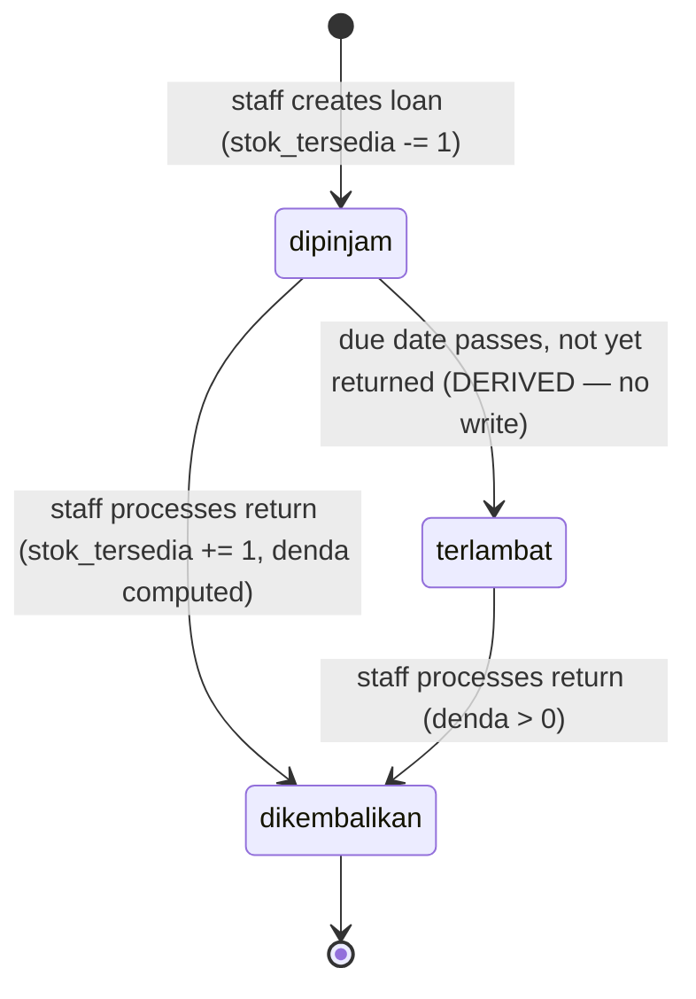

# 03 — Business Rules (Loan Lifecycle, Stock & Fines)

This is the **canonical** definition of the borrowing domain. The API guards
([05](./05-api-spec.md)), the UI button-enablement ([06](./06-frontend.md)), and the
dashboard counts all reference this doc — they must not re-derive the rules
independently. FRD requirement IDs are cited inline.

## Loan lifecycle



> **`terlambat` is derived, never stored.** The persisted `status` column is only
> ever `dipinjam` or `dikembalikan`. A loan is *effectively* `terlambat` when
> `tanggal_kembali_rencana < today AND tanggal_kembali_aktual IS NULL`. We compute
> this at read time. The dashed transition above is therefore not an action — it's
> the clock moving. **Why derive instead of store?** It avoids a background
> scheduler to flip rows at midnight and removes any risk of stale status; "overdue"
> is always exactly consistent with the current date. (LIST-02)

### Effective status (the function every read uses)

```ts
// apps/backend/src/lib/loan-status.ts
export function statusEfektif(p: {
  status: 'dipinjam' | 'dikembalikan'
  tanggalKembaliRencana: string   // YYYY-MM-DD
  tanggalKembaliAktual: string | null
}, today = todayISO()): 'dipinjam' | 'dikembalikan' | 'terlambat' {
  if (p.status === 'dikembalikan') return 'dikembalikan'
  return p.tanggalKembaliRencana < today ? 'terlambat' : 'dipinjam'
}
```

The DTO serializer always exposes `statusEfektif` so the UI never recomputes it.
Filtering by `status=terlambat` in the list endpoint becomes a WHERE clause:
`status = 'dipinjam' AND tanggal_kembali_rencana < CURDATE()`.

## Creating a loan (LOAN-01 … LOAN-08)

All guards run, then the **stock decrement and the loan insert happen in one
transaction**.

| # | Guard | Failure |
|---|-------|---------|
| 1 | Book exists | 404 |
| 2 | Member exists | 404 |
| 3 | `buku.stok_tersedia > 0` (LOAN-02) | 409 `"Stok buku tidak tersedia."` |
| 4 | `anggota.aktif = true` (LOAN-03) | 409 `"Anggota tidak aktif dan tidak dapat meminjam."` |
| 5 | Member has **no** active (`dipinjam`) loan for the **same** book (LOAN-04) | 409 `"Anggota masih meminjam buku ini."` |
| 6 | `tanggal_kembali_rencana >= tanggal_pinjam` (LOAN-07) | 422 `"Tanggal kembali harus pada atau setelah tanggal pinjam."` |

On success: `tanggal_pinjam` defaults to today if omitted (LOAN-08); status set to
`dipinjam` (LOAN-05); `buku.stok_tersedia -= 1` (LOAN-06).

```ts
// modules/peminjaman/service.ts — createLoan (pseudocode, names normative)
async function createLoan(input: CreateLoanInput) {
  return db.transaction(async (tx) => {
    const book = await repo.findBuku(tx, input.bukuId)        // 404
    const member = await repo.findAnggota(tx, input.anggotaId) // 404
    if (book.stokTersedia <= 0) throw new ConflictError('Stok buku tidak tersedia.')
    if (!member.aktif) throw new ConflictError('Anggota tidak aktif dan tidak dapat meminjam.')
    if (await repo.hasActiveLoan(tx, member.id, book.id))
      throw new ConflictError('Anggota masih meminjam buku ini.')
    const tanggalPinjam = input.tanggalPinjam ?? todayISO()
    if (input.tanggalKembaliRencana < tanggalPinjam)
      throw new ValidationError('Tanggal kembali harus pada atau setelah tanggal pinjam.')

    await repo.decrementStok(tx, book.id)                     // stok_tersedia -= 1
    return repo.insertLoan(tx, { ...input, tanggalPinjam, status: 'dipinjam', denda: 0 })
  })
}
```

## Returning a book (RET-01 … RET-06)

| # | Guard | Failure |
|---|-------|---------|
| 1 | Loan exists | 404 |
| 2 | Status is **not** already `dikembalikan` (RET-05) | 409 `"Peminjaman ini sudah dikembalikan."` |
| 3 | `tanggal_kembali_aktual >= tanggal_pinjam` (RET-06) | 422 `"Tanggal pengembalian tidak boleh sebelum tanggal pinjam."` |

On success, **in one transaction**: set `tanggal_kembali_aktual` (RET-02), compute
`denda` (see below), set status `dikembalikan` (RET-04), `buku.stok_tersedia += 1`
(RET-03, capped so it never exceeds `stok`).

```ts
async function kembalikan(id: number, tanggalKembali = todayISO()) {
  return db.transaction(async (tx) => {
    const loan = await repo.findLoan(tx, id)                  // 404
    if (loan.status === 'dikembalikan')
      throw new ConflictError('Peminjaman ini sudah dikembalikan.')
    if (tanggalKembali < loan.tanggalPinjam)
      throw new ValidationError('Tanggal pengembalian tidak boleh sebelum tanggal pinjam.')

    const denda = hitungDenda(loan.tanggalKembaliRencana, tanggalKembali)
    await repo.incrementStok(tx, loan.bukuId)                 // stok_tersedia += 1 (≤ stok)
    return repo.updateLoan(tx, id, {
      status: 'dikembalikan',
      tanggalKembaliAktual: tanggalKembali,
      denda,
    })
  })
}
```

## Fine calculation (FINE-01 … FINE-05)

```ts
// apps/backend/src/lib/fines.ts
export const DENDA_PER_HARI = 1000   // Rp 1.000/day — fixed (FRD §8), not configurable

/** Days late × Rp 1.000, floored at 0. Safe on a null actual date (FINE-03). */
export function hitungDenda(
  tanggalRencana: string,            // YYYY-MM-DD (due date)
  tanggalAktual: string | null,      // YYYY-MM-DD or null if not yet returned
): number {
  if (!tanggalAktual) return 0                                    // FINE-03
  const hariTerlambat = daysBetween(tanggalRencana, tanggalAktual) // aktual − rencana
  return Math.max(0, hariTerlambat) * DENDA_PER_HARI               // FINE-01, FINE-02
}
```

Rules:

- **FINE-01** `denda = max(0, days_late) × Rp 1.000`, `days_late = aktual − rencana`.
- **FINE-02** Returned on or before the due date ⇒ `denda = 0`.
- **FINE-03** A null `tanggal_kembali_aktual` ⇒ no fine computed (function returns 0;
  the stored `denda` of an unreturned loan stays `0`).
- **FINE-04** The UI shows a **preview** before the return is confirmed. The preview
  calls the *same* `hitungDenda` against the staff-picked return date — but the
  server recomputes authoritatively on submit; the client value is never trusted.
- **FINE-05** All amounts display as Indonesian Rupiah, e.g. `Rp 3.000` (see
  [08-conventions.md](./08-conventions.md#currency--dates)).

> **Projected fine for an active overdue loan (display only):** an unreturned
> `terlambat` loan has stored `denda = 0`, but lists may show a *projected* fine =
> `hitungDenda(rencana, today)` so staff see the accruing amount. This projection is
> computed in the DTO and is explicitly **not** persisted (consistent with FINE-03).
> Date math uses whole days; partial days are not counted.

## Stock invariants (must always hold)

1. `0 ≤ stok_tersedia ≤ stok` for every book, at all times.
2. Creating a loan decrements `stok_tersedia` by exactly 1, atomically with the
   insert; returning increments by exactly 1, atomically with the update.
3. `stok − stok_tersedia` = number of copies currently on loan (`dipinjam`). Editing
   `stok` may not push it below that count (BOOK-07).
4. A book/member with any `dipinjam` loan cannot be deleted (BOOK-08, MEMBER-08).

Because steps 2 are wrapped in `db.transaction(...)` and read the row `FOR UPDATE`,
two concurrent requests cannot both decrement the last available copy.

## Member-number generation

`no_anggota` is `LIB-` + a zero-padded 4-digit sequence (`LIB-0001`, `LIB-0042`,
…). Generated **inside the create transaction** to avoid races:

```ts
// modules/anggota/service.ts
async function generateNoAnggota(tx): Promise<string> {
  // Lock the highest existing number, increment, format.
  const max = await repo.maxNoAnggotaSeq(tx)   // SELECT MAX(CAST(SUBSTRING(no_anggota,5) AS UNSIGNED))
  const next = (max ?? 0) + 1
  return `LIB-${String(next).padStart(4, '0')}`
}
```

> Past `LIB-9999` the number simply grows to 5 digits (`LIB-10000`); the `padStart`
> is a *minimum* width, not a cap. The column is `varchar(20)`, leaving ample room.

## Edit & delete rules

| Operation | Rule |
|-----------|------|
| Edit book (`PUT /api/buku/:id`) | Any field editable. If `stok` increases, `stok_tersedia` increases by the same delta (BOOK-06). `stok` may not drop below copies-on-loan (BOOK-07). |
| Delete book (`DELETE /api/buku/:id`) | Allowed only if no active (`dipinjam`) loan (BOOK-08) → else 409. |
| Edit member (`PUT /api/anggota/:id`) | Any field editable; deactivation = set `aktif=false` (MEMBER-06). `no_anggota` is immutable. |
| Delete member (`DELETE /api/anggota/:id`) | Allowed only if no active loan (MEMBER-08) → else 409. |
| Edit loan (`PUT /api/peminjaman/:id`) | Permitted for correcting data entry (dates/refs) while still `dipinjam`; the return action is the dedicated `kembalikan` endpoint, not a generic edit. |
| Delete loan (`DELETE /api/peminjaman/:id`) | Allowed; if the loan was still `dipinjam`, the delete restores `stok_tersedia += 1` in the same transaction. |

## Status → Indonesian label (for UI)

The UI never shows raw enum values. Mapping lives in
`apps/frontend/src/lib/labels.ts` (tones authoritative in [12](./12-style-guide.md)):

| Effective status | Label | Badge tone |
|------------------|-------|------------|
| `dipinjam` | Dipinjam | blue |
| `terlambat` | Terlambat | red |
| `dikembalikan` | Dikembalikan | green |
