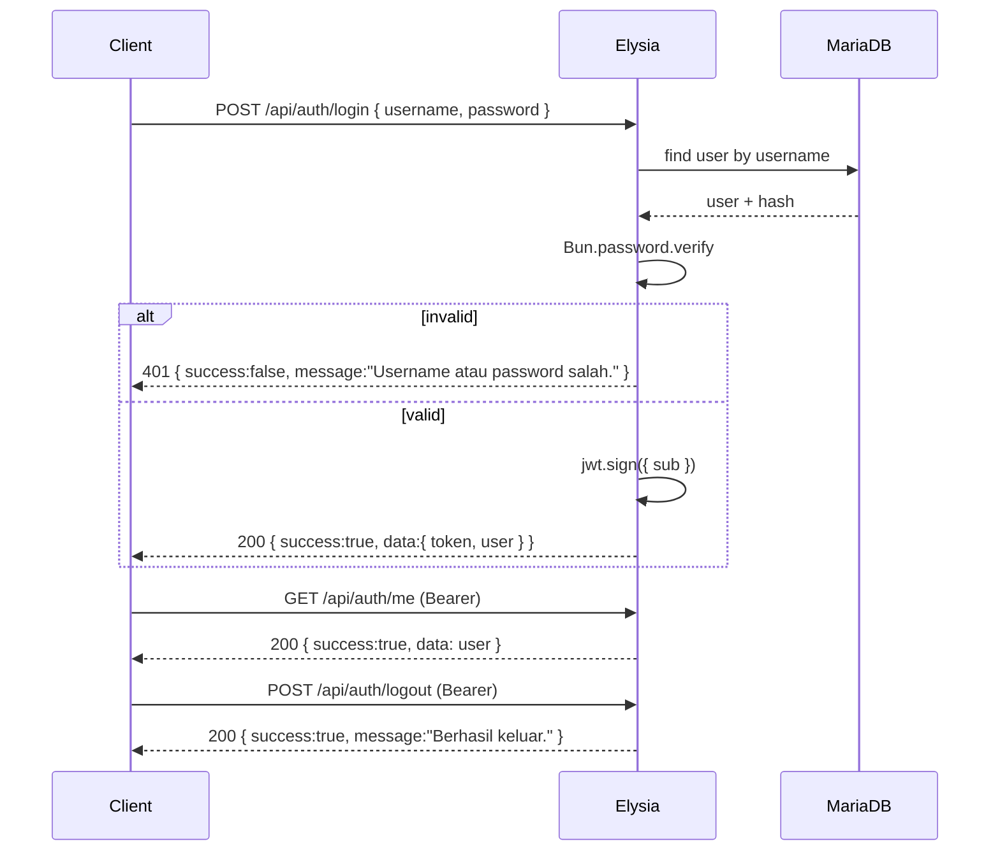

# 04 — Authentication

Model: **JWT bearer token** (stateless), **login-only — no roles**. The system has
a single kind of user: **library staff** (*petugas*). Every `/api/*` route except
login requires a valid token; there is **no role-based authorization** (RBAC is out
of scope — see [00-overview.md](./00-overview.md)). If multiple roles are ever
needed, this is the doc that grows a role column + access matrix; today it
deliberately does not.

> **Why add auth at all if there are no roles?** To gate the application behind a
> login so the library terminal isn't world-open, and to have a named actor for
> future auditing. Authentication (*who are you*) is in scope; authorization
> (*what may you do*) stays trivial — any authenticated staff member may do
> everything.

## User model

A single `users` table (see [02-data-model.md](./02-data-model.md) for the Drizzle
definition). Minimal by design:

| Field | Notes |
|-------|-------|
| id | PK |
| nama | display name |
| username | unique login handle |
| password | **argon2id hash** (never plaintext) |
| created_at / updated_at | timestamps |

No `role` column — every row is staff with full access.

## Token

- Library: `@elysiajs/jwt`.
- Algorithm: HS256, secret from `JWT_SECRET` (env).
- Expiry: `JWT_EXPIRES_IN` (default `7d`).
- Payload (minimal — never put the password or mutable profile data in the token):

  ```ts
  type JwtPayload = { sub: number }   // user id only; no role to embed
  ```

The full user record is loaded from the DB in the auth macro's `resolve`, so a
renamed user takes effect on the next request, not only on next login.

## Password hashing

`Bun.password` (argon2id by default). No external bcrypt/argon2 dependency.

```ts
const hash = await Bun.password.hash(plain)           // on create / change
const ok = await Bun.password.verify(plain, hash)     // on login
```

## Login / logout / me flow



**Logout with stateless JWT:** the server cannot truly invalidate a bearer token.
`POST /api/auth/logout` is a semantic endpoint that returns success; the client
discards the token from `localStorage`. (A denylist / short-expiry + refresh scheme
is the production upgrade path — out of scope here, documented for completeness.)

## Auth macro (the reusable guard)

A single Elysia macro derives the authenticated user. Because there are no roles,
it takes **no arguments** — it only asserts *authenticated*. Defining it once keeps
every route declarative.

```ts
// apps/backend/src/middleware/auth.ts
export const authMacro = new Elysia({ name: 'auth' })
  .use(jwt({ name: 'jwt', secret: env.JWT_SECRET }))
  .macro(({ onBeforeHandle }) => ({
    // usage: .get('/path', handler, { auth: true })
    auth(enabled: boolean) {
      if (!enabled) return
      onBeforeHandle(async ({ jwt, headers, set }) => {
        const token = headers.authorization?.replace('Bearer ', '')
        const payload = token ? await jwt.verify(token) : false
        if (!payload) {
          set.status = 401
          return envelope.fail('Token tidak valid atau sudah kedaluwarsa.')
        }
        const user = await usersRepo.findById(payload.sub)
        if (!user) {
          set.status = 401
          return envelope.fail('Pengguna tidak ditemukan.')
        }
        return { user }   // available to the handler via `resolve`
      })
    },
  }))
```

Every business route opts in with `{ auth: true }`. Only `POST /api/auth/login`
is public.

## Endpoint access summary

`✓` = requires a valid token (any staff user); `public` = no token needed. There is
no per-role column because there are no roles.

| Endpoint | Access |
|----------|--------|
| `POST /api/auth/login` | public |
| `POST /api/auth/logout` | ✓ |
| `GET /api/auth/me` | ✓ |
| `* /api/buku*` | ✓ |
| `* /api/anggota*` | ✓ |
| `* /api/peminjaman*` | ✓ |
| `GET /api/dashboard/stats` | ✓ |

Unauthenticated requests to any `✓` endpoint return **401** with an Indonesian
message (see [05-api-spec.md](./05-api-spec.md) and [08-conventions.md](./08-conventions.md)).

## Frontend integration (summary)

Detail in [06-frontend.md](./06-frontend.md):

- **Login page** (`/login`) — username + password, Indonesian errors.
- **Token storage** — `localStorage` key `perpustakaan_token`, mirrored into a
  small auth store (Zustand). The Eden client injects `Authorization: Bearer
  <token>` on every request.
- **ProtectedRoute** — wraps all pages; redirects to `/login` when there is no
  valid session. On any `401` response the client clears the token and redirects.

> **Security note (documented trade-offs):** storing the token in `localStorage` is
> the standard bearer pattern for this kind of app (XSS is the trade-off). Hashing
> is argon2id via `Bun.password`. Secrets (`JWT_SECRET`) come from env and must be a
> long random string in any real deployment (see [07-docker-deployment.md](./07-docker-deployment.md)).
